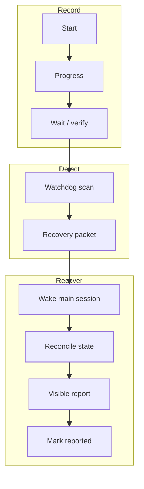

# OpenClaw Ledger

OpenClaw Ledger is a small recovery safety net for OpenClaw automation. It records progress, waits, verification, failures, and visible report delivery, then lets a watchdog detect unfinished work and wake the main session with a recovery packet.

Why it exists: long-running agent work can be interrupted by a session stop, Gateway restart, model failure, network issue, or missed Telegram delivery. Without a ledger, recovery has to infer what happened from chat history and logs. That can lead to duplicate work, repeated side effects, or a task that finished internally but was never reported to the user.

Most users do not run Ledger commands by hand. Install or wire it into your OpenClaw workflow, then let the orchestrator record work before side effects while a watchdog scans for stale or completed-but-unreported work. When recovery is needed, the watchdog wakes the main session so it can inspect the current state, continue safely, and send one visible completion report.

## When To Use It

Use Ledger for work where interruption would make recovery unsafe or confusing:

- file edits, commits, pushes, or generated artifacts
- subagents, browser automation, cron, Gateway, or external systems
- user approval gates or waiting states
- verification-heavy work where completion must be reported
- any task where repeating the same action could cause duplicate or risky side effects

Simple one-shot answers usually do not need Ledger.

## Flow

## What It Does

- Starts a durable work record before meaningful side effects.
- Records progress, waits, verification, failures, and report delivery.
- Detects stale or completed-but-unreported work through watchdog scans.
- Wakes the main session with recovery packets that contain enough context for safe reconciliation.
- Requires visible completion reporting before work is marked reported.

## How It Is Used

Install the CLI:

~~~bash
curl -fsSL https://raw.githubusercontent.com/moonhwilee/openclaw-ledger/main/install.sh | bash
~~~

Typical flow:

1. A task with meaningful state or side effects starts.
2. The orchestrator creates a Ledger entry.
3. Progress, waits, verification, and failures are appended as events.
4. If the session stops responding or completion was never reported, the watchdog scan produces a recovery packet.
5. The watchdog wakes the main session.
6. The recovered session inspects the current state, continues safely, sends one visible completion report, and records that the report was sent.

For command details:

~~~bash
openclaw-ledger --help
openclaw-ledger scan
~~~

## Repository Layout

- src/work_ledger.py - CLI implementation.
- tests/smoke/work_ledger_smoke.py - behavior smoke tests.
- docs/ledger.md - current behavior, recovery policy, and command reference.

## Local Tests

~~~bash
python3 -m py_compile src/work_ledger.py tests/smoke/work_ledger_smoke.py
python3 tests/smoke/work_ledger_smoke.py
~~~

## License

MIT
