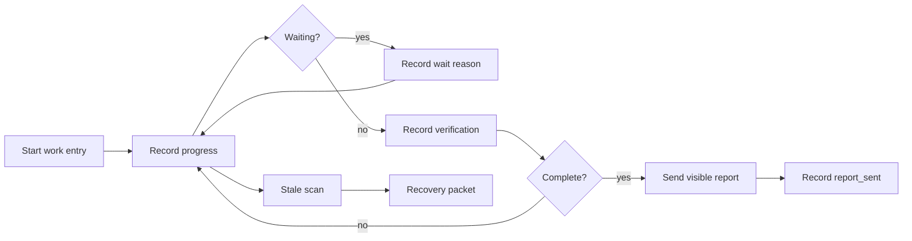

# OpenClaw Ledger

OpenClaw Ledger is a small recovery helper for long-running work. It records progress, waits, verification, failures, and visible report delivery so an interrupted OpenClaw session can recover safely.

Ledger is independent from GoalFlow. It can support goal-oriented work, but it does not decide whether a goal is complete.

## Flow

## What It Does

- Starts a durable work record before meaningful side effects.
- Records progress, waits, verification, failures, and report delivery.
- Detects stale or completed-but-unreported work.
- Produces recovery packets with enough context for safe reconciliation.
- Requires visible completion reporting before work is marked reported.

## Use

~~~bash
python3 src/work_ledger.py start --work-id example-work --request-summary "Implement and verify the requested change" --owner-session-key agent:main:example --visible-delivery '{"channel":"telegram","target":"example"}'
python3 src/work_ledger.py progress --work-id example-work --note "Implementation started"
python3 src/work_ledger.py verify --work-id example-work --verification '{"tests":"passed"}'
python3 src/work_ledger.py complete --work-id example-work --note "Work completed"
python3 src/work_ledger.py scan
~~~

## Repository Layout

- src/work_ledger.py - CLI implementation.
- tests/smoke/work_ledger_smoke.py - behavior smoke tests.
- docs/ledger.md - current behavior and recovery policy.

## Local Tests

~~~bash
python3 -m py_compile src/work_ledger.py tests/smoke/work_ledger_smoke.py
python3 tests/smoke/work_ledger_smoke.py
~~~

## License

MIT
