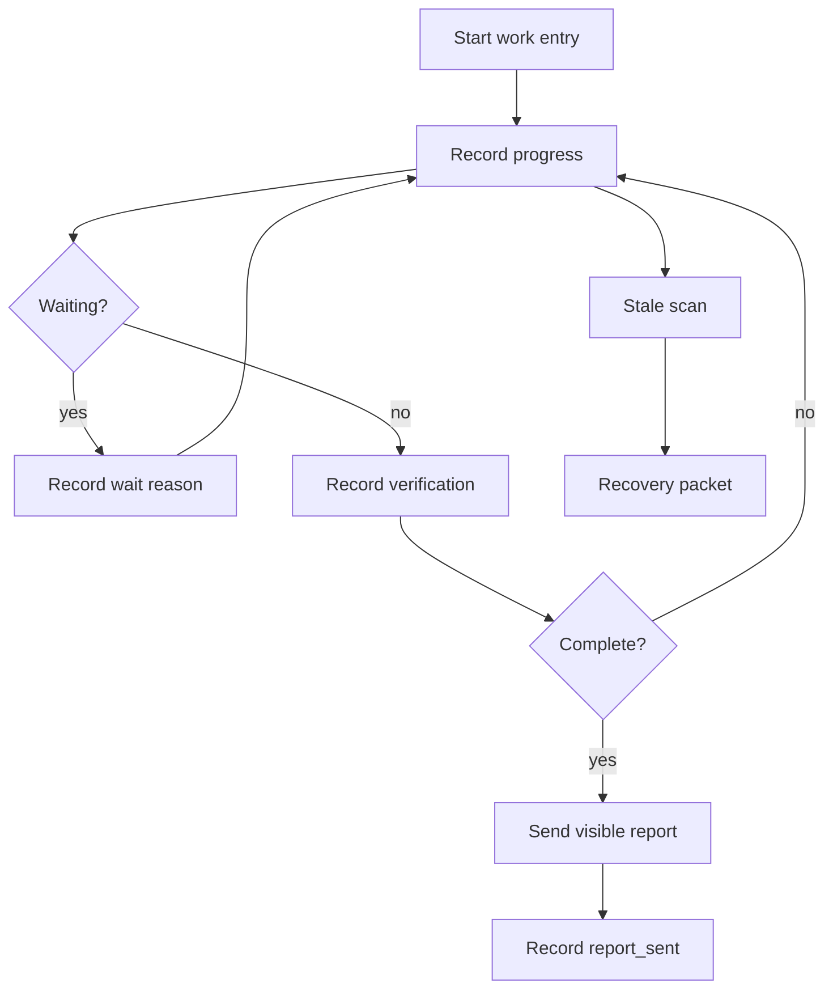

# OpenClaw Ledger

OpenClaw Ledger is a small recovery helper for long-running OpenClaw work. It records progress, waits, verification, failures, and visible report delivery so an interrupted session can recover safely.

Most users do not run Ledger commands by hand. Install or wire it into your OpenClaw workflow, then let the orchestrator record work before side effects, update progress during long tasks, and produce recovery packets when work becomes stale.

## Flow

## What It Does

- Starts a durable work record before meaningful side effects.
- Records progress, waits, verification, failures, and report delivery.
- Detects stale or completed-but-unreported work.
- Produces recovery packets with enough context for safe reconciliation.
- Requires visible completion reporting before work is marked reported.

## How It Is Used

Ledger is usually called by automation, not by the end user directly.

Install the CLI:

~~~bash
curl -fsSL https://raw.githubusercontent.com/moonhwilee/openclaw-ledger/main/install.sh | bash
~~~

Typical flow:

1. A long-running task starts.
2. The orchestrator creates a Ledger entry.
3. Progress, waits, verification, and failures are appended as events.
4. If the session stops responding, a scan produces a recovery packet.
5. The recovered session inspects the current state, continues safely, sends one visible completion report, and records that the report was sent.

Manual commands are useful for testing or custom integrations:

~~~bash
python3 src/work_ledger.py start --work-id example-work --request-summary "Implement and verify the requested change" --owner-session-key agent:main:example --visible-delivery '{"channel":"telegram","target":"example"}'
python3 src/work_ledger.py progress --work-id example-work --note "Implementation started"
python3 src/work_ledger.py verify --work-id example-work --verification '{"tests":"passed"}'
python3 src/work_ledger.py complete --work-id example-work --note "Work completed"
python3 src/work_ledger.py scan
~~~

## Repository Layout

- src/work_ledger.py - CLI implementation.
- tests/smoke/work_ledger_smoke.py - behavior smoke tests.
- docs/ledger.md - current behavior and recovery policy.

## Local Tests

~~~bash
python3 -m py_compile src/work_ledger.py tests/smoke/work_ledger_smoke.py
python3 tests/smoke/work_ledger_smoke.py
~~~

## License

MIT
